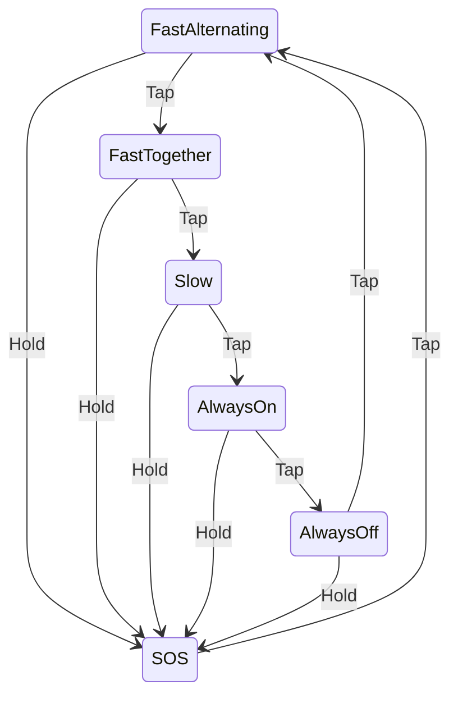

# blinky_carl2

* Two virtual (and real) LEDs, working in parallel
* If you hold, it sends SOS.
* Works by sending a schedule of on/off times. The schedule is a heapless Vec of Durations.
* When you hold, it reacts as soon as you've held long enough.
* Video: <https://youtu.be/_iQKyh3FGX4>
* [Wiring diagram](https://app.cirkitdesigner.com/project/38f41aba-e97e-46a3-81b6-35f196153c90)

This project is based on <https://github.com/U007D/blinky_probe/tree/main> from the
Embedded Rust Hardware Debug Probe workshop taught at the
Seattle Rust User Group in November 2024.

## Wiring Diagram

## License

Licensed under either:

* MIT license (see LICENSE-MIT file)
* Apache License, Version 2.0 (see LICENSE-APACHE file)
  at your option.
