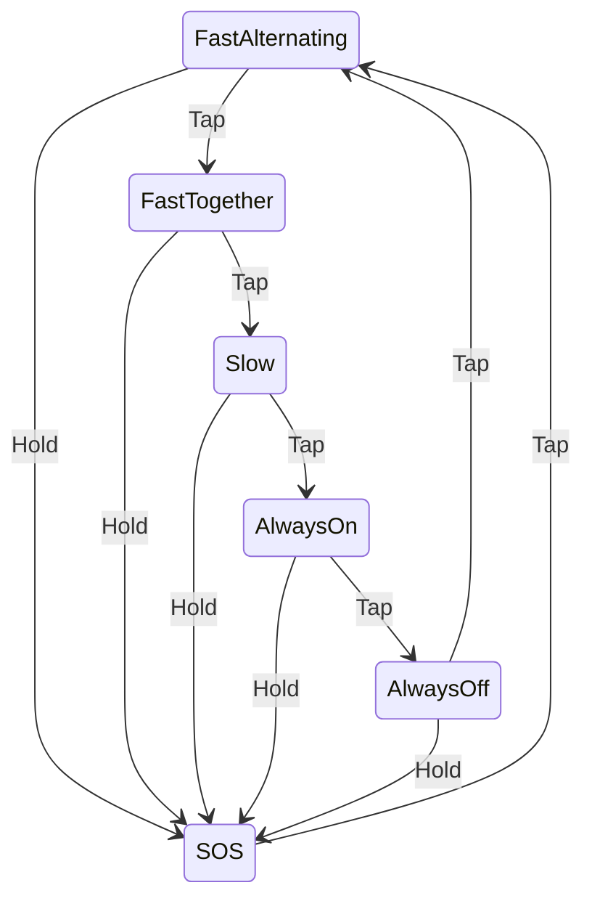

# dua_blinka

* Two virtual (and real) LEDs, working in parallel.
* If you hold the button, the LEDs send SOS.
* Each LED follows a schedule of on/off times. A schedule is a no_alloc Vec of Durations.
* If you hold the button long enough, the LEDs will react before you
   release.

This project is based on <https://github.com/U007D/blinky_probe/tree/main> from the
Embedded Rust Hardware Debug Probe workshop taught at the
Seattle Rust User Group in November 2024.

## State Diagram

## Wiring Diagram

## Video

## License

Licensed under either:

* MIT license (see LICENSE-MIT file)
* Apache License, Version 2.0 (see LICENSE-APACHE file)
  at your option.
