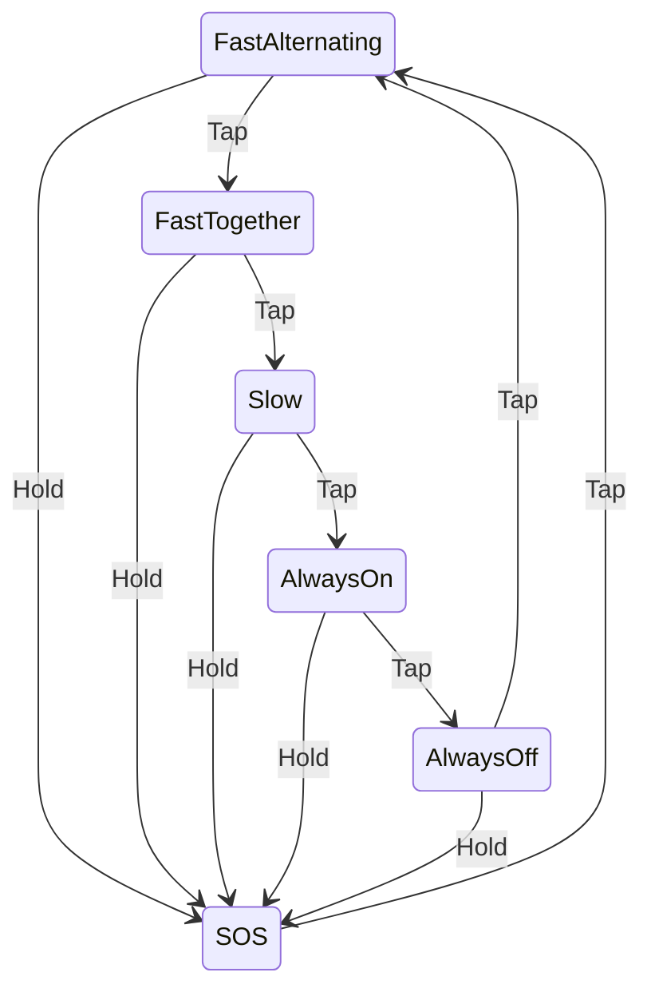
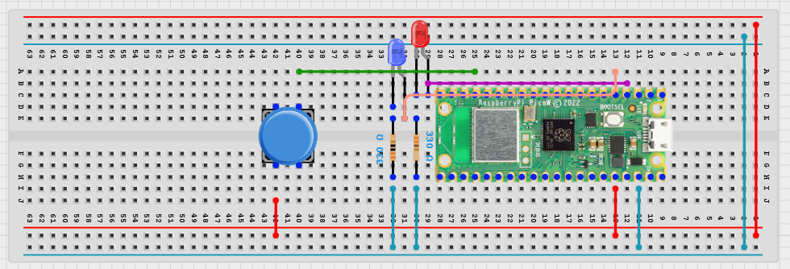

# dua_blinka

 

A Rust-based embedded example featuring abstract and real LEDs controlled with `Embassy`

## Features

- **Two virtual (and real) LEDs** working in parallel.
- **SOS signal** when holding the button.
- **Scheduled LED behavior** using a `no_alloc` Vec of `Durations`.
- **Responsive input handling**—holding the button long enough triggers a reaction *before* release.

## Related Article

**[How Rust & Embassy Shine on Embedded Devices (Part 1): Insights for Everyone and Nine Rules for Embedded Programmers](https://medium.com/@carlmkadie/how-rust-embassy-shine-on-embedded-devices-part-1-9f4911c92007)**  
by **Carl M. Kadie & Brad Gibson**, free on Medium.

## State Diagram

## Wiring Diagram

## Video

## License

Licensed under either:

- MIT license (see LICENSE-MIT file)
- Apache License, Version 2.0 (see LICENSE-APACHE file)
  at your option.
